<p align="center">
    
</p>

<div align="center">

[](https://github.com/rerender2021/language-shadow/actions/workflows/build.yml) [](https://github.com/rerender2021/language-shadow/actions/workflows/pack.yml)

 </div>
 
# 简介

文影 (Language Shadow) 是一个简单的翻译器，原理：

-   使用 OCR 识别指定区域，获得文字用于翻译。目前支持离线情况下，英文翻译成中文。
-   GUI 部分则是使用 [Ave React](https://qber-soft.github.io/Ave-React-Docs/) 开发的。


演示视频见:

-   [文影：实时英语字幕翻译 - 完全离线、免费且开源](https://www.bilibili.com/video/BV1Cs4y1j7Qb/)

# 使用说明

- 软件首页：https://rerender2021.github.io/products/language-shadow/

# 开发者向

## 本地开发

```bash
> npm install
> npm run dev
```

开发过程中需要确保本机启动了 OCR 服务器和翻译服务器。

-   OCR 服务器：https://github.com/rerender2021/PaddleocrAPI/releases/tag/1.0.1
-   翻译服务器：https://github.com/rerender2021/NLP-API/releases/tag/1.0.1

下载它们，并解压到项目下，确保项目目录结构如下：

```
- nlp-server
    - NLP-API.exe
    - ...
- ocr-server
    - PaddleocrAPI.exe
    - ...
- src
- ...
- package.json
```

## 功能扩展

运行过程中，OCR 和翻译会请求本地接口，因此，不使用以上离线服务器，而是自己起一个服务器对接在线 API，也可正常使用。

相关接口和数据结构约定见代码：

-   OCR: [./src/ocr/paddle-ocr.ts](./src/ocr/paddle-ocr.ts)
-   翻译: [./src/nlp/helsinki-nlp.ts](./src/nlp/helsinki-nlp.ts)

## 打包发布

-   生成 exe

```bash
> npm run release
```

-   将 `ocr-server` 和 `nlp-server` 复制到 `bin` 目录中，和 exe 一起压缩打包。

# 开源协议

[MIT](./LICENSE)

# 赞赏

`:)` 如果此软件值得赞赏，可以请作者看小说，一元足足可看八章呢。

<p align="left">
    
</p>
